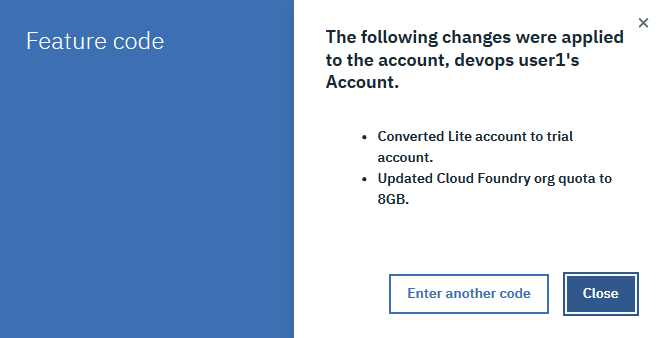

# Apply a feature code to your IBM Cloud Lite account


📝 You should see the promo code assigned to you on the Portal exercise page. If you do not see the promo code as shown in the following figure, please contact _IBM Skills Academy_ by using the support tool to request a promo code for this course.


You can use the promo code \(also known as _feature code_\) provided to students of this course to unlock extra resources or capabilities that are not available in the standard IBM Cloud Lite account.

Complete these tasks to apply a feature code to you IBM Cloud account:

* [ ] Log in to I[BM Cloud](https://cloud.ibm.com/login).
* [ ] In the top navigation click **Manage** &gt; **Account**.

* [ ] Click **Account settings**.

* [ ] Under Subscription and Feature Codes, click **Apply Code**.

* [ ] Enter the feature code \(also known as promo code\) that was provided to you for this course and click **Apply**.


 📝 This feature code will add extra capabilities to your IBM Cloud Lite account. You can apply a feature code to only one IBM Cloud account, and the code cannot be removed after it is applied.


* [ ] A window listing the changes to your account as a result of applying the feature code is displayed. Click **Close**.

