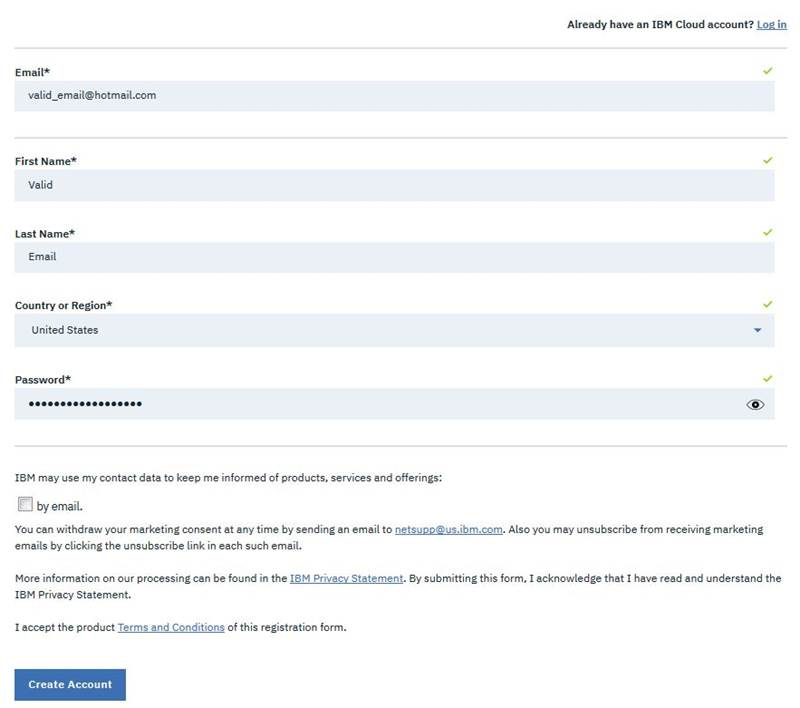
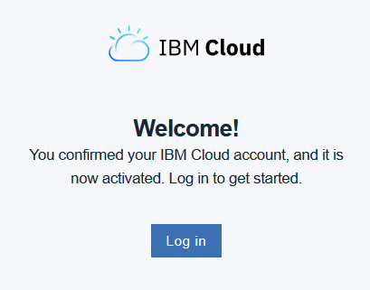

# Create a free IBM Cloud account

You must have an IBM Cloud Lite account. This account gives you access to the IBM Cloud resources that you need to perform the exercises. This account will never expire so you can continue using it after the class. For more information about IBM Cloud Lite account see [IBM Cloud free tier](https://www.ibm.com/cloud/free).


If you already have an IBM Cloud account skip this section.


You need to register with IBM Cloud by providing a valid email address. Your email address acts as your user name for IBM Cloud, and you provide a password for it. The email address that you use to register with IBM Cloud and the password that you provide on registration, will also become your **IBM ID**. You can use this IBM ID to log in to other IBM web sites that require you to enter your IBM ID and password.

When you sign up to IBM Cloud, you will be prompted for your demographic information \(such as your name and company\). An email is sent to the email account that you provide in the registration to confirm that your email account is valid and active.

Perform the following tasks:

1. [ ]  Go to the IBM Cloud website [https://cloud.ibm.com/login](https://cloud.ibm.com/login).

* [ ] Click **Create an IBM Cloud account**.
* [ ] You will be presented with a form, fill it out with your personal information.


You must use a valid email for signing up to IBM Cloud; IBM Cloud sends you an email to verify your account.



‼   ****If you already have an IBM ID associated with your email, you will see the following form instead of the one shown in the previous figure.


 If you already have an IBM Cloud account, click **Log in** to verify that you can access IBM Cloud.

* [ ] Click **Create Account**. 
* [ ] You will be asked to identify images to ensure that you are a real person.

* [ ] After you finish the verification tasks, you will be redirected to a page similar to this figure.

* [ ] Check your email at the account that you used to sign up to IBM Cloud. You will receive an email similar to the one shown.


‼ You must complete the registration by accessing your email, otherwise you will not be able to log in to IBM Cloud.


* [ ] Click **Confirm Account.**

The IBM Cloud Welcome! page is displayed confirming that you have now activated your IBM Cloud account.

You have now successfully signed up for an IBM Cloud account. You are ready to log in to IBM Cloud when directed to do so by the exercises in this course.

* [ ] Confirm that you can log in to IBM Cloud.
  * [ ] Go to IBM Cloud and click **Log in**.
  * [ ] Enter the email and password that you used to register to IBM Cloud. You should be able to access the environment.
  * [ ] Review the IBMid Account Privacy and click **Proceed**.

You have now successfully signed up for an IBM Cloud account. You are ready to log in to IBM Cloud when directed to do so by the exercises in this course. Close your browser.

