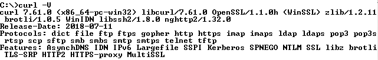

# Download and install cURL

cURL is a command-line tool for transferring data by using various protocols. One of the most popular protocols is HTTP, which is used to receive information from or upload data to web servers. 

You might have to use cURL to install some of the tools that are required by the exercises such as IBM Cloud CLI.

### Check whether cURL is already installed

Complete the following tasks to check whether cURL is already installed in your workstation:

* [ ] Open a command line \(Windows\) or terminal \(MacOS\).
* [ ] Run the following command:

```text
curl -V
```

If the response is similar to the following figure, cURL is already installed in your workstation.



