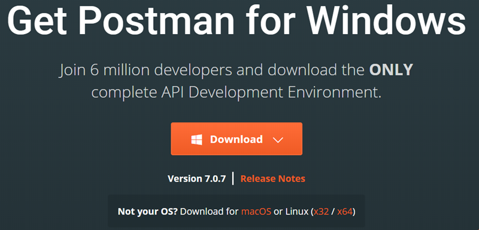

# Download and install Postman

Postman is an application for interacting with HTTP APIs. It presents you with a GUI for constructing requests and reading responses. In this section, you download and install the Postman.

* [ ] Open the following link in your web browser: [https://www.getpostman.com/downloads/](https://www.getpostman.com/downloads/)
* [ ] Download the installer that is compatible with your operating system. In the following figure, Windows is chosen.

* [ ] After the installer is downloaded, open it and follow the wizard to install it on your workspace.

