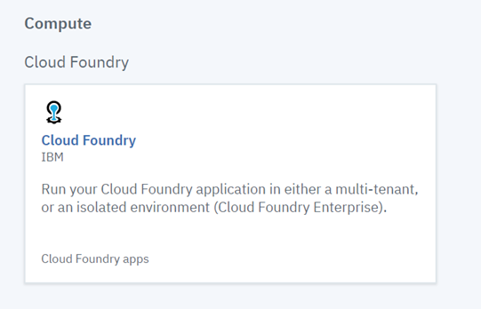
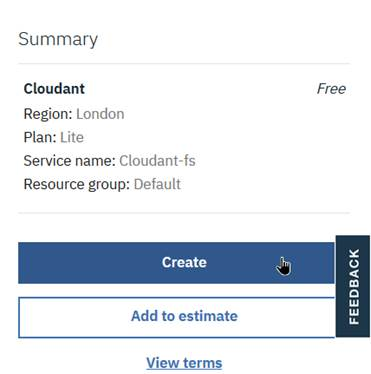
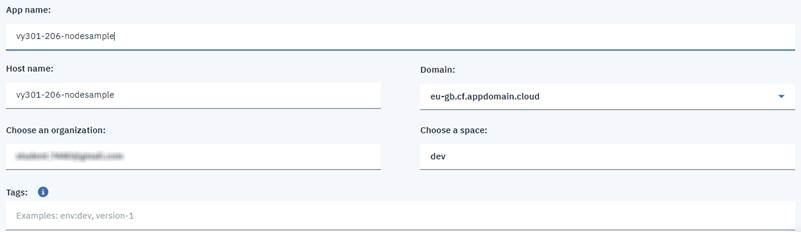
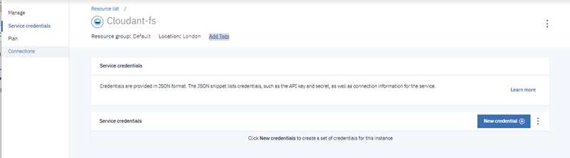
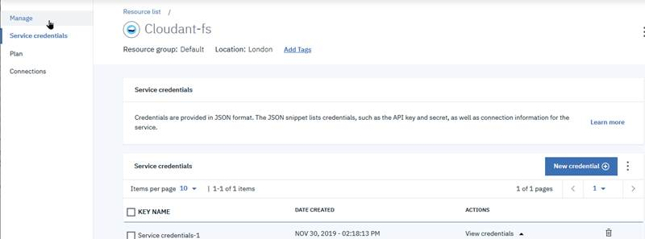

# Exercise 1. Getting started with Cloud Foundry apps on IBM Cloud

#### Estimated time

1:00

## Overview

The focus of the application developers is on the business value of the application that they are creating. Developers should spend most of their time on the features, functions, and usability of their applications. 

However, to realize the usefulness of their applications, developers often must deal with server management and installing and configuring the run time and framework that their application requires to run. 

This exercise describes how you can deploy a web application \(app\) without downloading or configuring a runtime environment or framework or setting up a server. This exercise also covers how to test and run the app when it is deployed.

## Objectives

After completing this exercise, you should be able to perform the following tasks:

* Log in to IBM Cloud from a browser. 
* Create an IBM Cloud application by using one of the available run times. 
* Install the IBM Cloud command line interface \(CLI\). 
* Sign on to IBM Cloud from the CLI. 
* Deploy an application from a local workstation by using the IBM Cloud CLI. 
* Test the application with its endpoint after the application is deployed and started.

## Introduction

With IBM Cloud, you focus on rapidly building compelling user experiences rather than worrying about managing the infrastructure that underlies your applications. This exercise shows how to get started with a web app in IBM Cloud. You download and modify a sample app without worrying about the server configuration. Finally, you learn how to deploy the changes to the app and see them in action.

## Requirements

This exercise requires the following prerequisites:

* IBM Cloud account.
* IBM Cloud CLI installed in your workstation.

## Exercise instructions

In this exercise, you complete the following tasks:

1. Obtain your ran
2. Log in to IBM Cloud**.**  
3. Create an application.  ****
4. Modify and redeploy your Cloud Foundry app**.**
5. Check your organization limits.
6. Delete the sample application


If you encounter any issues when you follow this exercise, see [Troubleshooting](https://marcela-adan1.gitbook.io/essentials-of-cloud-application-development/workshop/exercise-2.-developing-ibm-cloud-applications-with-ibm-cloud-continuous-delivery#troubleshooting)


### Part 1. Obtaining your randomly generated key

The exercises require that you create several objects, each of which should have unique names. You use an online tool to generate a random key to ensure that the names of your objects are unique.

* [ ] Go to [https://www.uuidgenerator.net/](https://www.uuidgenerator.net/). You see a string of 36 letters, numbers, and hyphens. The online UUID generator shows the Universally Unique Identifier \(UUID\). Write down the first three characters on a piece of paper. This is your randomly generated key.
* [ ] The first three characters in the UUID are used in the naming convention for this exercise. For example, if the UUID that is returned by the UUID generator was `20644124-9e5c-4246-a098-993843099d71`, then the key you should use in the object name is 206. Every time that you see `xxx` as part of the object name in the exercises, replace it with your key.


### Part 2. Logging in to IBM Cloud

Log in to IBM Cloud by completing the following tasks:

* [ ] Open the IBM Cloud console \([https://cloud.ibm.com](https://cloud.ibm.com)\) in a web browser.
* [ ] In the “Log in to IBM Cloud” right pane, complete the following steps:
  * [ ] Leave the “IBMid” selected from the drop-down list.
  * [ ]  Enter the email address that you used to register for IBM Cloud
  * [ ] Click **Continue**. 
  * [ ] Enter your password and click **Log in**.


You are redirected to the Dashboard, as shown in the following figure.


### Part 3. Creating an application

The IBM Cloud catalog lists components and services that help you build your application. In this part, you create an IBM Cloud application with the IBM software development kit \(SDK\) for the Node.js runtime:

* [ ] Create an application with an instance of the IBM SDK for Node.js runtime environment:
  * [ ] On the IBM Cloud Dashboard, click **Create resource** on the right, as shown in the following figure.


* [ ] You can now see the entire catalog. In the Search field, type “_Cloud Foundry_”. 
* [ ] Select Cloud Foundry under Compute, as shown in the following figure.



* [ ] From Cloud Foundry overview page, click **Create** under _Public Applications_ as shown in the following figure.


Complete the details for creating a Cloud Foundry Sample App:

* [ ] Region is selected by default based on your location. In this example, the region is London.




**TROUBLESHOOTING**: If you see the error “_Deployment in multiple regions is not available in Lite accounts, Upgrade your account to enable access to multiple regions_.”, as shown in the following figure, click the drop-down menu under **Select a region** and switch to the region to which you have access. Repeat the step to create your app.



* [ ] If you do not have a Lite account, skip this step. For Lite accounts, Pricing Plans show that the memory that is allocated to your app by default is 64 MB. For this exercise, select the maximum allocation of **256 MB**, as shown in the following figure.


* [ ]  Select **SDK for Node.js** from the provided runtimes as shown in the following figure.


* [ ] Enter the app name. In the App name field, enter “**vy301-xxx-nodesample**”. Replace `xxx` with the first three characters of your randomly generated key, as shown in the following figure. For example, if the randomly generated key is 206, the app name is `vy301-206-nodesample.`
* [ ] The host name is set by default to the app name, as shown in the following figure.
* [ ] The domain is selected based on your location, which is London in this example.


✍ Ensure that the selected domain has the format `{region}.cf.appdomain.cloud.`Do **not** select `mybluemix.net` as a domain because it is deprecated.


In this example, the location for the IBMid that was used to log in to IBM Cloud is _London_ and the corresponding domain, which is selected automatically is `eu-gb.cf.appdomain.cloud.`

* [ ] The organization is set by default to the email IBMid \(email\) that you used to log in.
* [ ] The space is set by default to dev, as shown in the following figure.



* [ ] Click **Create**.


IBM Cloud proceeds to deploy your application. Your application stages and deploys in a few minutes.


🛑 Wait until the application finishes staging and it is running in IBM Cloud before you proceed to the next step. For Lite accounts, wait for the application status “_This app is awake_”, as shown in the following figure.



If you do not have a Lite account, the application status should be “Running”, as shown in the following figure.


* [ ] Click **Visit App UR**L, which opens a new browser tab with the URL for your app `https://vy301-xxx-nodesample.{region}.cf.appdomain.cloud/,` where `xxx` is your randomly generated key. The domain is different according to your region/location; in this example, the domain is `eu-gb.cf.appdomain.cloud.`
* [ ] Clicking this link opens a new browser tab or page that shows your app. Confirm that the sample application appears, as shown in the following figure.


* [ ] Close the browser page for Hello World.

### Part 4. Modifying and redeploying your Cloud Foundry app

Now that you successfully deployed your application, you modify the code and push the changes out to Cloud Foundry with IBM Cloud CLI by completing the following tasks:

* [ ] Download and extract the sample application:
  * [ ]  ****Return to the **Application Details - IBM Cloud tab** on your browser**.**
  * [ ] Make sure that **Getting started** is selected, as shown in the following figure. 
  * [ ] Click **download the sample code** under **Getting started with SDK for Node.js** as shown in the following figure.



✍ If the hyperlink to download the sample code is not available, access the sample code directly from [https://github.com/IBM-Cloud/get-started-node](https://github.com/IBM-Cloud/get-started-node).


* [ ] Download the sample code to your local workstation in the directory `C:\IBM-Cloud`. Click **Clone or download** and select **Download ZIP** as shown in the following figure.


* [ ] Extract the contents of the file into a source code directory for your application.

Connect to IBM Cloud by using the IBM Cloud CLI:

* [ ] In a Command Prompt window \(Microsoft Windows\) or terminal \(Mac OS or Linux\), change to the directory with the sample code. On almost any operating system, you can do this with the `cd` command.

  For example, if you extracted the contents of the application to `\IBM-Cloud\get-started-node-master\get-started-node-master`, running `cd C:\IBM-Cloud\get-started-node-master\get-started-node-master`takes you to the correct location, as shown in the following figure.   
  If you run `dir` \(Windows\) or ls ``\(MAC OS and Linux\) and see the `manifest.yml` or `package.json`files, you are in the correct location, as shown in the following figure.


* [ ]  ****Use your favorite text editor to open the `manifest.yml`. For example, if you extracted the application source code to `C:\IBM-Cloud,`then this file is in `C:\IBM-Cloud\get-started-node-master\get-started-node-master\manifest.yml.`
* [ ]  Change the name from `GetStartedNode` to your app name, `vy301-xxx-nodesample`, where `xxx` is the randomly generated key that you use in this exercise. 
* [ ]  `random-route: true` generates a random route to the application. To use the same application name as the route of the application, remove `random-route: true`, as shown in the following figure.



* [ ] Make sure that you are in the directory that contains the Node.js app code that you downloaded previously. Log in to the IBM Cloud with the CLI:

```text
ibmcloud login -u username -p password –r region
```


✍ You can use the one-time passcode option to log in with a federated ID. Specify the single sign-on \(SSO\) parameter ibmcloud login --sso to get a one-time passcode that you then enter at login, as shown in the following figure.



Target the region that corresponds to the location that was set by default when you created the application. See Regions at [https://cloud.ibm.com/docs/cloud-foundry-public?topic=cloud-foundry-public-endpoints\#endpoints\_regions](https://cloud.ibm.com/docs/cloud-foundry-public?topic=cloud-foundry-public-endpoints#endpoints_regions)

* The region for Sydney is `au-syd`. 
* The region for Frankfurt is `eu-d`e.
* The region for London is `eu-gb`. 
* The region for Dallas is `us south`. 
* The region for Washington, D.C is `us east`.

The command response is as follows:

> `c:\IBM-Cloud\get-started-node-master\get-started-node-master>ibmcloud login -u  -p  -r eu-gb API endpoint:` [`https://cloud.ibm.com`](https://cloud.ibm.com) `Authenticating... OK  
> Targeted account Student20 Cloud20's Account (f6eeaf39ae6b477fbcead1993509e9c6)`
>
> `Targeted region eu-gb`
>
> `API endpoint:` [`https://cloud.ibm.com`](https://cloud.ibm.com)   
> `Region: eu-gb   
> User:  <The email that you used to register to IBM Cloud>  
> Account:  <f6eeaf39ae6b477fbcead1>  
> Resource group: No resource group targeted, use 'ibmcloud target -g RESOURCE_GROUP'   
> CF API endpoint: Org: Space:  
> Tip: If you are managing Cloud Foundry applications and services  
> - Use 'ibmcloud target --cf' to target Cloud Foundry org/space interactively, or use 'ibmcloud target --cf-api ENDPOINT -o ORG -s SPACE' to target the org/space.   
> - Use 'ibmcloud cf' if you want to run the Cloud Foundry CLI with current IBM Cloud CLI`

* [ ] Now, you are logged in to IBM Cloud. To select the Cloud Foundry API endpoint, organization, and space to which you deploy your application, run the following command. Enter the same organization and space that were used when the application was created.

```text
ibmcloud target --cf-api <CF API ENDPOINT> -o <ORG> -s <SPACE>
```

* Use --cf-api to specify the Cloud Foundry API endpoint to which to deploy the application. Select it based on the region where the application was created. For the complete list of API endpoints see _API Endpoints_ at [https://cloud.ibm.com/docs/cloud-foundry-public?topic=cloud-foundry-public-endpoints\#api-endpoint-options](https://cloud.ibm.com/docs/cloud-foundry-public?topic=cloud-foundry-public-endpoints#api-endpoint-options)
  * `https://api.us-south.cf.cloud.ibm.com` for US SOUTH.
  * `https://api.eu-gb.cf.cloud.ibm.com` for EU-GB.
  * `https://api.us-east.cf.cloud.ibm.com` for US EAST
  * `https://api.eu-de.cf.cloud.ibm.com` for EU-DE.
  * `https://api.au-syd.cf.cloud.ibm.com` for AU-SYD.

In this example, `https://api.eu-gb.cf.cloud.ibm.com` is used, which is the API endpoint for the region `EU-GB` and location `London.`

* Use `-o` to specify the organization, which is the email that you used to register to IBM Cloud.
* Use `-s` to specify the space, which is `dev.`

The following example shows the ibmcloud target command and options on Windows. 

```text
ibmcloud target --cf-api https://api.eu-gb.cf.cloud.ibm.com -o <your_email> -s dev

```

You receive the following output \(API version might be different\):

> Targeted Cloud Foundry`(https://api.eu-gb.cf.cloud.ibm.com)`
>
> `Targeted org <you_email>  
> Targeted space dev  
> API endpoint: https://cloud.ibm.com   
> Region: eu-gb   
> User:  \<your_email\>  
> Account:  \<your_account_name\>(f6eeaf39ae6b477fbcead1993509e9c6)   
> Resource group: Default   
> CF API endpoint: https://api.eu-gb.cf.cloud.ibm.com (API version: 2.106.0)   
> Org:  \<your_email\>  
> Space: dev`

* [ ] Upload and deploy the sample application to push the contents of the current directory as a Cloud Foundry application on IBM Cloud by running the following command:

```text
ibmcloud cf push vy301-xxx-nodesample
```

The following example shows a sample results for the `ibmcloud cf push` command on W`indows:`

> `Pushing from manifest to org  / space dev as ... Using manifest file C:\IBM-Cloud\vy301-206-nodesample\manifest.yml Getting app info...   
> Updating app with these attributes...   
> name: vy301-206-nodesample   
> path: C:\IBM-Cloud\get-started-node-master\get-started-node-master   
> command: npm start   
> disk quota: 1G   
> health check type: port   
> instances: 1   
> memory: 256M   
> stack: cflinuxfs3   
> routes: vy301-206-nodesample.eu-gb.cf.appdomain.cloud  
> Updating app vy301-206-nodesample... Mapping routes...  
> .........................................................................................`
>
> `Waiting for app to start... Cell 476dc2a8-fa9b-4a7f-8572-cf9138ff6cfe successfully destroyed container for instance 9b232c41-3960-430b-999e-f46d67fb1aae`
>
> `name: vy301-206-nodesample requested state: started routes: vy301-206-nodesample.eu-gb.cf.appdomain.cloud last uploaded: Sun 24 Nov 16:07:50 CST 2019 stack: cflinuxfs3 buildpacks: sdk-for-nodejs`
>
> `type: web   
> instances: 1/1   
> memory usage: 256M   
> start command: npm start   
> state since cpu memory disk details`
>
> `Waiting for app to start... Cell 476dc2a8-fa9b-4a7f-8572-cf9138ff6cfe successfully destroyed container for instance 9b232c41-3960-430b-999e-f46d67fb1aae`
>
> `name: vy301-206-nodesample   
> requested state: started  
> routes:` **`vy301-206-nodesample.eu-gb.cf.appdomain.cloud`** `last uploaded: Sun 24 Nov 16:07:50 CST 2019   
> stack: cflinuxfs3   
> buildpacks: sdk-for-nodejs`
>
> `type: web   
> instances: 1/1   
> memory usage: 256M   
> start command: npm start   
> state since cpu memory disk details`
>
> `0   running   2019-11-24T22:08:04Z   0.1%   41.8M of 256M   80.6M of 1G`

Wait until the CLI exits and you return to the command prompt. This is how you know that your files finished uploading.


✍Because you already created the application `vy301-xxx-nodesample` earlier by using the IBM Cloud console, pushing the application from the CLI overwrites the contents of the existing application on IBM Cloud. If you do not have an existing Cloud Foundry application of the same name on IBM Cloud, pushing the application creates an application on IBM Cloud.


Confirm that your sample application is running by completing the following tasks:

* [ ] Open the application URL in a web browser. The URL is listed in the command prompt output \(routes\). In this example the URL is `vy301-206-nodesample.eu-gb.cf.appdomain.cloud`. 
* [ ] Confirm that the sample application is deployed successfully, as shown in the following figure.


* [ ] Modify the source code to produce a necessary change. Open the file `get-started-node-master\views\index.html` in your favorite text editor. 
* [ ] In line 8, change Hello World to Greetings. and in line 30 change Welcome. to Greetings as shown in the following figure.


* [ ]  Save the file and exit your text editor.
* [ ] Return to the Command Prompt and run the push command to upload and deploy the application again with the new changes:

```text
ibmcloud cf push vy301-xxx-nodesample
```


✍ Replace `xxx` by your unique value.



🛑 Wait until the CLI exits and you return to a command prompt.


* [ ] To confirm that your changes are deployed successfully, refresh the application page in the browser and check that “Welcome.” is replaced by “Greetings.” as shown in the following figure.


* [ ] Close both the command prompt and the web browser for your application page.

### Part 5. Checking your organization limits

Your IBM Cloud Lite account provides only some services and a maximum amount of random access memory \(RAM\) that your apps can use. In this section you check the amount of memory allocated to your application. Complete the following tasks:

* [ ] Open IBM Cloud console \([https://cloud.ibm.com/](https://cloud.ibm.com/)\) in your browser. Click the **Navigation Menu** \(the three dashes at the upper left\) as shown in the following figure.


* [ ] Click **Resources List** to open the Resources List to access your application, as shown in the following figure.


View the amount of consumed resources in your dashboard:

* [ ] Click your application name that is listed under Cloud Foundry Apps, as shown in the following figure.



* [ ] Note the **Runtime** tile. The following figure shows that your application consumes 256 MB of the allotted memory in this IBM Cloud organization. In the next part, you delete the application to clean up your organization for the next exercise.



✍ Depending on your account type, you might be allotted a different amount of RAM or other resources in IBM Cloud. The amount of RAM for you might be different from the example.


### Part 6. Deleting the sample application

In this part, you delete your app so that your IBM Cloud organization is clean and ready for the next exercise. To delete the sample application complete the following tasks:

* [ ]  Find and click the gear menu icon to the right of your app name. You are presented with a list of options, as shown in the following figure.


* [ ] Select **Delete** to delete your application.
* [ ] You are presented with a pane, as shown in the following figure. Confirm that you want to delete the application, and delete the route \(ensure that this box is selected\). Click **Delete**.



‼ An IBM Cloud Lite account provides up to 256 MB of application memory for Cloud Foundry Apps and 100 Cloud Foundry services. To free the resources that are assigned to your application, either stop your application or delete it. If you used up your quota for services, you must delete the existing services to make room for new ones.


## 👩🎓 Exercise review and wrap-up

In this exercise, you registered for an IBM Cloud account and explored the IBM Cloud dashboard and catalog by signing in with your IBMid. Then, you created an IBM Cloud application with the IBM SDK for Node.js runtime environment. You used the IBM Cloud CLI to modify the source code of the sample application on your local workstation and redeployed the updated application from your local workstation to your IBM Cloud account by using the IBM Cloud CLI.

