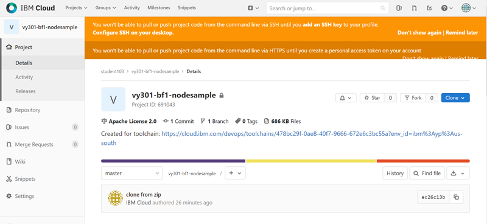
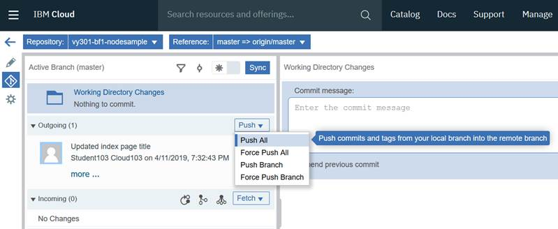
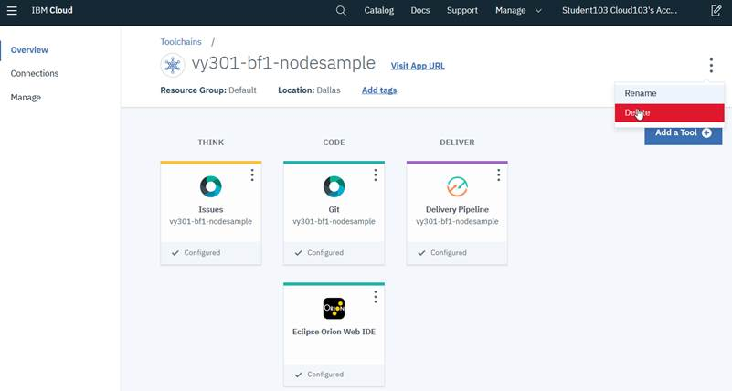
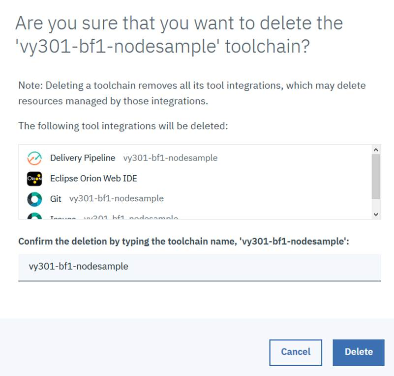
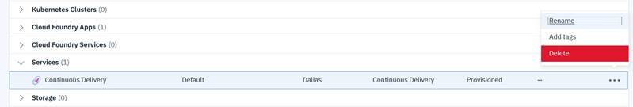

# Exercise 2. Developing IBM Cloud applications with IBM Cloud Continuous Delivery

#### Estimated time

01:30

## Overview

Development Operations \(DevOps\) is a software methodology that integrates application development and information technology \(IT\) operations.

Application development includes writing code, testing the code, building fixes, integrating the fixes, building the application, and deploying the application.

IT operations include managing the environment on which the applications run, providing compute power to the applications, and making the software secure, scale, and run more efficiently.

Because development and operations were traditionally separate groups, “living” in their own isolated worlds several issues arise.

DevOps blurs the lines between the development tasks and operational tasks by integrating processes and tools.

DevOps provides real value to the business. For example, it enables continuous delivery, so when new application features are complete, they can be automatically rolled into production. In turn, this action reduces time-to-market, provides competitive advantages, and reduces cost.

DevOps automates the deployment of fixes after they are tested and approved.

DevOps enables developers to customize and change applications quickly, improving customer satisfaction. DevOps enables a more stable environment and better application quality. The combination of a shared code base, continuous integration, test-driven techniques, and automated deployments expose problems in application code, infrastructure, or configuration earlier in software development.

In this exercise, you explore DevOps services in IBM Cloud. The IBM Cloud catalog provides multiple tools for DevOps, but this exercise is focused on IBM Cloud Continuous Delivery. Continuous Delivery enables you to build, test, and deliver applications by using DevOps practices and industry-leading tools.

## Objectives

After completing this exercise, you should be able to perform the following tasks:

* Enable your application to use IBM Cloud Continuous Delivery. 
* Create a Git repository to manage your source code. 
* View and edit code in the Eclipse Orion Web integrated development environment \(IDE\). 
* Build and deploy code to IBM Cloud. Test the application in IBM Cloud.

## Introduction

IBM Cloud provides an online space to implement your DevOps model. The IBM Cloud Continuous Delivery service provides a set of online development tools. When you enable Continuous Delivery Toolchain for your application, you can choose to have a source code repository that is hosted by IBM and built on GitLab Community Edition.

In the delivery pipeline, you can commit and restore files in your project.

The IBM Cloud Continuous Delivery service also provides a rich IDE for developing, testing, and deploying IBM SDK for Node.js applications by using a web browser. The web IDE is called Eclipse Orion. It provides you with syntax highlighting and API reference features that you expect in a desktop application.

In this exercise, you work with the IBM Cloud Continuous Delivery services to explore, develop, build, and deploy IBM Cloud applications.

## Requirements

This exercise requires access to the internet and an IBM Cloud account.

## Exercise instructions

In this exercise, you complete the following tasks:

1. Re-create your application.
2. Examine the IBM Cloud application. 
3. Enable Continuous Delivery for the starter application. 
4. Review your application in Eclipse Orion web IDE. 
5. Invite collaborators. 
6. Edit the sample application. 
7. Commit your changes to the Git repository. 
8. Deploy the application from the Git repository to IBM Cloud. 
9. Deploy the application directly from your project workspace to IBM Cloud. 
10. Automatically push changes to IBM Cloud \(optional\). 
11. Clean up the application and Continuous Delivery service and tools.


If you encounter issues when you follow this exercise, check the Troubleshooting section.


### Part 1. Re-creating your application

In this part, you re-create the sample Node.js starter application that you deleted at the end of Exercise 1. Complete the following tasks:

* [ ] Open the IBM Cloud console in your web browser: \[[https://cloud.ibm.com\]\(https://cloud.ibm.com](https://cloud.ibm.com]%28https://cloud.ibm.com)

  %20

  \)

* [ ] Log in to your IBM Cloud account. Enter your IBM ID and password, as shown in the following figure.

* [ ] Click **Continue**. Confirm that your IBM Cloud Dashboard page loads.
* [ ] Perform the steps in [Exercise 1, Part 3, “Creating an application”](https://marcela-adan1.gitbook.io/essentials-of-cloud-application-development/workshop/exercise-1.-getting-started-with-cloud-foundry-apps-on-ibm-cloud#part-3-creating-an-application) to create a Node.js application.

### Part 2. Examining the IBM Cloud application

In this part, you explore the application overview page in your IBM Cloud account. The overview page lists the status of your application and the resources that it uses. Complete the following tasks:

* [ ] Open the application page for your sample application. Click the **Navigation Menu** icon at the upper left of the IBM Cloud window and click **Resource List**, as shown in the following figure.

* [ ] Expand the **Cloud Foundry Apps** section and click the application that you created in [Part 1](https://app.gitbook.com/@marcela-adan1/s/essentials-of-cloud-application-development/~/drafts/-M8wandhLirZoWs-qfjD/exercise-2.-developing-ibm-cloud-applications-with-ibm-cloud-continuous-delivery#part-1-re-creating-your-application) of this exercise, as shown in the following figure.

* [ ] In the Application Details page, click **Overview** from the left navigation bar, as shown in the following figure.


✍ The state of the application might differ according to your account type. It can be in the “This app is awake” state, as shown in the figure, for Lite accounts or “Running” for non-Lite accounts.


* [ ] Test the sample application. Click **Visit App URL** for your application, as shown in the following figure.

* [ ] A new tab opens in the browser that shows your app. Confirm that the sample application appears, as shown in the following figure.

* [ ] Close the Node.js starter application web page.

### Part 3. Enabling Continuous Delivery for the starter application

In this part, you enable continuous delivery for your application. The Continuous Delivery service supports your DevOps workflows:

* You can create integrated DevOps open toolchains to enable tool integrations that support your development, deployment, and operations tasks.
* Deliver continuously by using automated pipelines. 
* Edit and push your code from anywhere by using the web-based IDE. 
* Collaborate with your team and manage your source code with a Git repository \(repos\) and issue tracker that is hosted on the cloud.

To enable continuous delivery for your application, perform the following tasks:

* [ ] In the overview page for the vy301-xxx-nodesample application, scroll down to Continuous delivery and click **Enable**, as shown in the following figure.

* [ ] Click **Tools** to expand the tools bar.

* [ ] The bar expands and displays the tools that are created when you create the toolchain as shown in the following figure.

* **Issue Tracker**: Use this tool to track problems in your application.
* **Repository**: Git repo that you can use to control versions of your application and collaborate with your team to manage your source code.
* **Web IDE \(Eclipse Orion\)**: Use this tool to edit and change your code.
* **Pipeline**: Use this tool to automate builds, unit tests, deployments, and more. The stages in the pipeline can automatically build when you push changes to a linked repository and then deploy to one or more environments on IBM Cloud.
* [ ] Close the bar by clicking **Tools** again.
* [ ] On the same page, check the Toolchain Name, the Select Region, and the Select a resource group fields, which are already populated, as shown in the following figure. Keep the default values and scroll down to the Tool Integrations section.

* [ ] In the Tool Integrations section, click **Delivery Pipeline** to create an API key that enables communication between the different Toolchain components and IBM Cloud. Click **Create+** to create the API key, as shown in the following figure.


🗝 **API keys**: An API key is a unique code that is passed in to an API to identify the calling application or user. API keys are used to track and control how the API is being used, for example to prevent malicious use or abuse of the API. The API key often acts as both a unique identifier and a secret token for authentication, and generally has a set of access that is specific to the identity associated with it.

In this case, you create a new API key for the logged-in user. This allows the Delivery Pipeline to authenticate with this user's credentials to IBM Cloud so that it can deploy the application. If you have an existing IBM Cloud API key, you can enter it in the IBM Cloud API Key field.


* [ ] Confirm the creation of the API key by clicking **Create**, as shown in the following figure.

* [ ] Finally, click **Create** in the top bar to enable Continuous Delivery Toolchain for the starter application, as shown in the following figure.


🛑 Wait until the wizard creates the Git repository for your application.


* [ ] You are redirected to the Toolchains dashboard, as shown in the following figure.


✍ By enabling Continuous Delivery Toolchains, you perform a Git clone for the IBM Cloud starter code by default.


* [ ] Confirm that the Git repository was created by right-clicking the Git box and then selecting **Open link in new tab**. The GitLab web-based Git repository manager is displayed, as shown in the following figure.

* [ ] Close this browser tab.


✍ IBM Cloud Continuous Delivery creates a Git repository as a change management system. You can use any Git client to work with the artifacts that are stored in the repository.


### Part 4. Reviewing your application in Eclipse Orion web IDE

In this part, you review your application project in Eclipse Orion Web IDE, which is a browser-based development environment. You invite other users to your project so the team can collaborate in code development and deployment.

Complete the following tasks:

* [ ] Click **Eclipse Orion Web IDE** to open the code editor.
* [ ] Examine the workspace. By default, the project’s overview page is opened, and you can see the project directory that is collapsed on the left, as shown in the following figure.

* [ ] Review the application components that are shown in the following figure by scrolling down the overview page.

The Node.js application \(`vy301-xxx-nodesample`\) section includes the `app.js` file that contains the code, a license file, an archive of the deployment in IBM Cloud that is called `manifest.yml`, an archive of libraries that are required for Node.js application that is called `package.json`, and a readme file that is called `README.md`. The last two sections show the Git repository location and some details about JavaScript, including the libraries that are used, as shown in the following figure.

* [ ] Expand the application files in the left pane and open the README.md file by clicking it, as shown in the following figure.

The `README.md` file provides a quick summary of the repository that manages your application artifacts and source code. It is a best practice to provide an up-to-date description of your project in this document, especially for projects that are publicly shared for all users.


✍ Information: The README.md file is written with the Markdown syntax, which is a lightweight markup language for annotating plain text documents to be displayed as Hypertext Markup Language \(HTML\) documents. For more information about Markdown, see: [http://daringfireball.net/projects/markdown/](http://daringfireball.net/projects/markdown/)

For more information about guidelines for building a good readme file, see: [https://github.com/IBM-Cloud/repo-guidelines/blob/master/README.md\#readmemd-structure](https://github.com/IBM-Cloud/repo-guidelines/blob/master/README.md#readmemd-structure)


### Part 5. Inviting collaborators

Invite project members to the toolchain that you created with the Delivery Pipeline and also to the Cloud Foundry organization that includes your deployed application. The main goal here is to enable other users to change the code and deploy your application in a developing environment with multiple participants.

* [ ] Go to the main menu in IBM Cloud and select **Manage** &gt; **Access \(IAM\)**, as shown in the following figure.

* [ ] Click **Invite users**, as shown in the following figure.

* [ ] In this exercise, you give users access to a service and more specifically, to a resource, which is the Toolchain resource, and the Cloud Foundry application \(Node.js runtime\). Enter the **email of the user** to which you want to grant access and scroll down to **Assign users additional access** pane, as shown in the following figure.

* [ ] Add access to the Toolchain instances. In the “Assign users additional access” section, select **IAM services**. Under “What type of access do you want to assign?” select **Toolchain** in **Account**, as shown in the following figure.

* [ ] For **Service instance** select **All instances**. Then, select the level of access \(Administrator, Editor, Operator, or Viewer\) for the resource under “Platform access” and click **Add** as shown in the figure.

* [ ] Add access to the Cloud Foundry application.  In the “Assign users additional access” pane, select **Cloud Foundry** to give access to the Cloud Foundry organization to which the resource belongs. Complete the Organization \(use your IBM ID\), Organization roles, Region, Space, and Space roles fields and then click **Add**, as shown in the following figure. In this example, you grant **Developer** access to the user.

* [ ] Click **Invite**.

### Part 6. Editing the sample application

In this part, edit your application code with Eclipse Orion web IDE by completing the following tasks:

* [ ] Open the sample application in Eclipse Orion. Click the **Navigation Menu** icon   in the upper left and click **Resource List**, as shown in the following figure.

* [ ] Expand Cloud Foundry Apps and click your application \(**vy301-xxx-nodesample**\).
* [ ] Scroll down and click View toolchain, as shown in the following figure.

* [ ] Click **Eclipse Orion Web IDE**.
* [ ] Expand the project \(**vy301-xxx-nodesample**\) to confirm that a set of files and directories are in the project, as shown in the following figure.

The following options are available:

* The **Edit** option \(first icon\) provides a graphical editor to manage and update project files.
* The **Git** option allows you to select and check in files from the project into the Git repository. 
* The **Settings** option allows you to view and modify the settings to customize the Web IDE. You can choose the color schemes, technical tools, and settings that meet your development needs.
* [ ] Click **app.js** from the project directory and examine the contents of the app.js source code in the editor, as shown in the following figure.

The editor in the web application provides the same features as the desktop Eclipse application:

* Syntax highlighting. 
* Static code analysis of the JavaScript code. 
* A preview of the document.
* [ ] Place your cursor in line 16 next to the term `express() in var app = express().`
* [ ] Press **Ctrl + Spaceba**r on your keyboard. You see the window that is shown in the following figure.

The code completion feature in the JavaScript editor supports Node JavaScript modules and the standard JavaScript functions.

* [ ] Examine the HTML templates in the sample application welcome page. In the project directory on the left, expand the **public** folder. 
* [ ] Click i**ndex.html**. The window that is shown in the following figure opens.  The built-in editor also highlights and validates HTML web page markup.

* [ ] Select the sentence in line 19.
* [ ] Change the phrase inside the  tags to “Hello node sample!”, as shown in the following figure.

* [ ] All the code changes are automatically saved. To force the save operation, press **Ctrl + S** to save your changes.

### Part 7. Committing your changes to the Git repository

In this part, you see the effects of the source code changes by committing your changes to the Git repository, and then pushing the changes to your IBM Cloud application. You commit the source code, configuration files, and other artifacts to the Git repository. Also, you deploy the application changes from the Git repository to the application in your IBM Cloud account. In the next Part, you learn that Delivery Pipeline automatically deploys the changes that are pushed to the Git repository as an application in your IBM Cloud account.

Complete the following tasks:

* [ ] Switch to Git in the left navigation bar. Click the **Git** icon in the left pane, as shown in the following figure.

* [ ] Add and commit the changes in the project to the Git repository.  Examine the Working Directory Changes pane, as shown in the following figure. The Working Directory Changes window lists the files that you added to the workspace or modified. 
* [ ] Enter “**Updated index page title**” into the comment window. 
* [ ] Make sure that the **Select All** check box is selected.

* [ ] Click **Commit** to save the files into the Git repository


✍ Information: If you are prompted to provide the author and committer names as mandatory fields, enter your name and email.


* [ ] Examine the Working Directory Changes view.  Confirm that there are no more updated files to commit from the Working Directory Changes section and that the change set is in the Outgoing section, as shown in the following figure.


✍ Do not perform this step; it is for your information only. You can revert to the last saved version of your source code in the Git repository. To do so, select the change set that you want to revert in the Outgoing section and hover your cursor over the eraser icon, as shown in the following figure. Do not click the eraser icon now


* [ ] Push your changes from the local branch to the remote Git branch by clicking the **Push** drop-down menu and selecting Push All in the Outgoing pane, as shown in the following figure.

You can see that the Outgoing pane is clear because all commits were pushed to the remote Git repository, as shown in the following figure.

* [ ] Examine the Git repository commits log. Click the back-arrow \(**Back to Toolchains**\) icon in the upper left of the Eclipse Orion Web IDE page, as shown in following figure

* [ ] Click **Git** from the Continuous Delivery Toolchain dashboard.
* [ ] Click **Repository** from the left navigation bar. 
* [ ] Click **Commits**, as shown in the following figure. Examine the Git COMMITS for vy301-xxx-nodesample.

* [ ] Click **Git** from the Continuous Delivery Toolchain dashboard.
* [ ] Click **Repository** from the left navigation bar.
* [ ] Click **Commits**, as shown in the following figure. Examine the Git COMMITS for `vy301-xxx-nodesample.`

You can see the last commit and all commits from the beginning. Because you chose the default value \(**Clone**\) for the Repository type when you created the Continuous Delivery Toolchain, the figure shows the “Initial commit” action, which indicates that the Node.js sample code was cloned \(**Clone from zip**\). Each commit action has a unique identifier, user name, and date and time stamp.

### Part 8. Deploying the application from the Git repository to IBM Cloud

There are two ways to deploy an application to your IBM Cloud account:

* • Deploy from the Git repository. You can use Delivery Pipeline to automate the application deployment when changes are pushed to Git. 
* Deploy directly from your project workspace in Eclipse Orion.


✍ If more than one developer is working on a project, consider checking in your changes and pushing the most recent revision from the Git repository.


* [ ] Validate that the app is deployed automatically when changes are pushed to Git by using Delivery Pipeline.  Click the **Navigation Menu** icon   in the upper left and select Resource List, as shown in the following figure.

* [ ] Select your application from the **Cloud Foundry Apps** menu**.**
* [ ] From the Application Details page, click **View toolchain**.
* [ ] A new tab opens and shows the toolchain. Click **Delivery Pipeline**, as shown in the following figure.

* [ ] Examine the delivery pipeline. Wait until the build and deploy tasks complete successfully, as shown in the following figure.

* [ ] **E**xamine the updated code. In Deploy Stage, click **View console** to view the application overview, as shown in the following figure.


✍ By default, a Git push on the master Git branch triggers the application to be built and deployed automatically. Pushing the changes to any other branch does not trigger a deployment unless this branch is merged with the master branch. If required, you can modify the Delivery Pipeline to automatically trigger a build if a change is pushed to a branch other than the master branch.


* [ ] In the Application Overview section, click **Visit App URL**, as shown in the following figure.

* [ ] Confirm that the application web page changed to “Hello node sample!” as shown in the following figure.

### Part 9. Deploying the application directly from your project workspace to IBM Cloud

You can publish changes to your application directly from the Eclipse Orion Web IDE to IBM Cloud. With this technique, you can quickly test changes to your code on an actual IBM Cloud account by completing the following tasks:

* [ ] In the Eclipse Orion Web IDE, edit the message in the sample application web page.

  On the Toolchains page, click **Eclipse Orion Web IDE** and switch to Edit mode from the left navigation bar.

* [ ] Open index.html in the public folder, as shown in the following figure.

* [ ] In line 19 of i`ndex.html`, change the heading to  `Welcome to the sample application!`as shown in the following figure.

* [ ] All the code changes are automatically saved. To force the save action, press **Ctrl + S**.
* [ ] Deploy the application directly from your project workspace. Configure the application deployment settings by clicking **Create new launch configuration** and then the plus button \(+\) in the upper center of the Eclipse Orion Web IDE window, as shown in following figure.

* [ ] Wait until the deployment settings are loaded in the page. You see the Edit Launch Configuration window with all the fields populated. Click **Save**, as shown in the following figure.

* [ ] In the application status toolbar, click the play icon that has the tooltip **Deploy the App from the Workspace** when you hover your cursor over the icon, as shown in the following figure.

* [ ] You are prompted to confirm that you want to stop and redeploy the application `vy301-xxx-nodesample`. Click **OK**, as shown in the following figure.

* [ ] Wait until the application is stopped, deployed, and started, as shown in the following figure.

* [ ] **\*\*Confirm that the changes appear in the application. In the server toolbar, click** Open the Deployed App\*\* to view the changes to your application, as shown in the following figure.

* [ ] Verify that the updated heading appears. The “Welcome to the sample application!” message in the sample application web page is displayed as shown in the following figure.

### Part 10. Automatically push changes to IBM Cloud \(optional\)


✍ This part cannot be performed with an IBM Cloud Lite account. You need a Pay-As-You-Go account or a Subscription account. If you are a university student, you can apply for a no-charge feature code. Check with your instructor.


With the stop and redeploy option, you must first manually deploy the changes and trigger an application restart through the server toolbar. Although this option is more convenient than having to commit your changes to the Git repository, it can be disruptive to your software development workflow for minor changes.

The _IBM Cloud Live Sync_ feature automatically pushes any saved changes in the project workspace to a linked IBM Cloud application. For IBM SDK for Node.js applications, you can update static files and view the updates on IBM Cloud without restarting your application. Alternatively, for the non-static Node.js code, such as JavaScript files, you need to restart only your application without having to deploy the changes.

To automatically push changes to IBM Cloud, complete the following tasks:

* [ ] Return to the Eclipse Orion Web IDE web page and enable the Live Edit feature.  Near the server’s toolbar, click the switch icon next to **Live Edit,** as shown in the following figure.

* [ ] Click **OK** to redeploy the application and enable Live Edit mode, as shown in the following figure. Enabling Live Edit mode allocates more memory to the application to enable debugging.


✍ The quota for the IBM Cloud Lite account is 256 MB, and applications that have Live Edit enabled require 800+ MB on average; this is the reason why this part of the exercise cannot be performed with an IBM Cloud Lite account. Here is the error message that you receive if you are using an IBM Cloud Lite account.



* [ ] Confirm that Live Edit mode is enabled, as shown here   .


✍If you have a synchronization error, restart the application.


* [ ] Wait until the application is running in Live Edit mode, as shown in the following figure. It might take a few minutes

* [ ] _\*\*_Change the sample application web page heading. On the i`ndex.html` web page, edit the heading to read `Welcome to the live edit sample application!,` as shown in the following figure.


✍ With the Live Edit feature, you do not need to save or deploy your static files. Changes are saved and deployed to your IBM Cloud account automatically. Examples of static files include HTML web pages and Cascading Style Sheets \(CSS\). However, you might still need to commit your files in Git if you want other people to see them.


* [ ] Confirm that the changes appear in your IBM Cloud application. In the server toolbar, click the **Open the Deployed App** icon to view the changes to your application, as shown in the following figure.

* [ ] Verify that the updated heading appears in the sample application web page, as shown in the following figure.

### Part 11. Cleaning up the application and Continuous Delivery service and tools

In this part, you clean up the application and the Continuous Delivery Toolchains dashboard by completing the following tasks:

* [ ] Delete the Git repository. Go to the Toolchains dashboard and click **Git**.

* [ ] Click **Settings** on the left tab.

* [ ] Scroll-down and click **Expand** in the Advanced section.

* [ ] Select **Remove project**. 
* [ ] Click **Remove project** as shown in the following figure.

* [ ] In the confirmation window, enter your application name and click **Confirm** as shown in the following figure.

* [ ] Delete the toolchain. Open the Continuous Delivery Toolchains dashboard. Click the **menu** icon and click **Delete**, as shown in the following figure.

* [ ] Type your application name \(vy301-xxx-nodesample\) in the confirmation window and click **Delete**, as shown in the following figure.

* [ ] Click the **Navigation Menu** icon at the upper left and click **Resource List**, as shown in the following figure.

* [ ] In the Resource List window, expand Cloud Foundry Apps, click the Actions menu \(three dots\) for your application, and select **Delete**, as shown in the following figure.

* [ ] Confirm that you want to delete the routes and click **Delete**, as shown in the following figure.

* [ ] In the Resource List window, expand **Services** and delete the Continuous Delivery service. Click the Actions menu to the right of the service and select **Delete**, as shown in the following figure.

* [ ] Confirm the deletion of the resource, as shown in the following figure.

* [ ] Log out of IBM Cloud.
* [ ] Close your web browser.

## 🎓Exercise review and wrap-up

In this exercise, you used IBM Cloud Continuous Delivery to manage your IBM Cloud application that is written for the IBM SDK for Node.js server runtime.

Then, you saved your changes in the Git repository. Through the Delivery Pipeline, you automatically deployed the committed source code changes to your IBM Cloud application.

In the last part of the exercise, you deployed your changes directly from the project workspace. Optionally, you also used the IBM Cloud Live Sync feature to push changes to static files without redeploying the application and without having to restart it.

## 🤓 Troubleshooting

This section lists common problems that students might encounter while you perform this exercise. If your app status is “unknown” or your app status is “not running”, click the Overview link in the upper left of the window, as shown in the following figure.

Next, click **Restart** at the upper right options, as shown in the following figure to restart your app.

You can also refresh the page to force your browser to fetch the status of your app.

