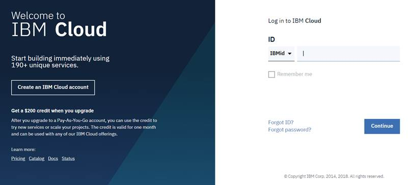
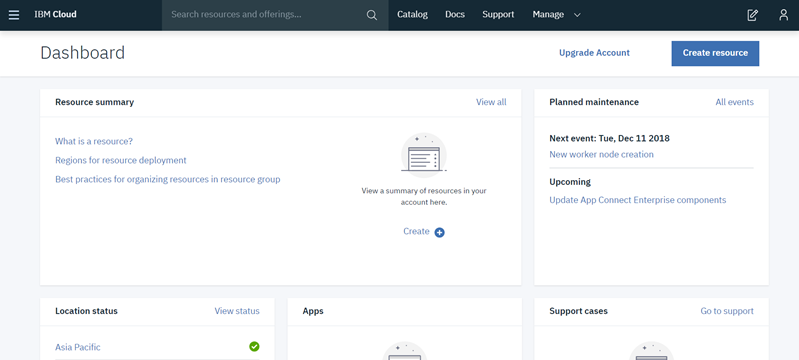
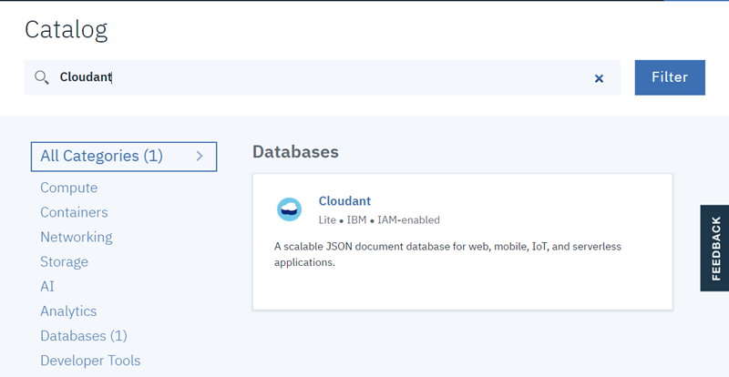

# Exercise 3. IBM Cloud with IBM Cloudant

#### Estimated time

00:50

## Overview

NoSQL databases are built from the ground up to scale globally, run non-stop, and handle a wide variety of data types, such as JavaScript Object Notation \(JSON\), full-text, and geospatial. Cloudant is a NoSQL database that is optimized for handling heavy workloads of concurrent reads and writes in the cloud. These workloads are typical of large, fast-growing web, and mobile applications \(apps\). 

This exercise shows you how to create an instance of a Cloudant service on IBM Cloud. You use your Cloudant service instance to discover various features of the Cloudant service and understand the different methods that are available to use the HTTP APIs by using IBM Cloud Identity and Access Management. You also learn how to use Cloudant HTTP APIs to apply create, read, update, and delete operations by creating indexes and by using Cloudant Query on Cloudant documents.

## Introduction

Cloudant is built on Apache CouchDB and contributes to the open source project. IBM Cloudant is a NoSQL database as a service \(DBaaS\) that frees developers from worrying about managing the database and enables them to focus on the application. 

Cloudant is designed to ensure that the flow of data between an application and its database remains uninterrupted and performs to users’ satisfaction. Cloudant can run across many servers in a database cluster, resulting in high availability \(HA\) and fault tolerance. The data replication technology also enables developers to put data closer to where their applications need it most. 

Your app’s data persistence layer can be durable and highly available with IBM Cloudant. Your data is securely hosted and globally managed by big data experts 24x7. 

This exercise demonstrates how you can create a Cloudant database service on IBM Cloud without installing or configuring the database instance on your workstation. You use an HTTP API client such as Postman to create, read, update, and delete Cloudant documents. You learn how to create indexes and query data by using Cloudant API endpoints.

## Exercise instructions

In this exercise you will complete the following tasks:

1. Log in to IBM Cloud. 
2. Create an instance of the Cloudant service. 
3. Explore the Cloudant service on IBM Cloud. 
4. Create credentials for a Cloudant service instance. 
5. Explore the features of the Cloudant dashboard. 
6. Use an HTTP API client to access Cloudant. 
7. Delete your Cloudant service instance.

### Part 1. Logging in to IBM Cloud

In this section, you log in to your IBM Cloud account by providing your own credentials. Complete the following tasks:

* [ ] Log in to your IBM Cloud account. From your web browser, go to [https://cloud.ibm.com/login](https://cloud.ibm.com/login).
* [ ] Enter your IBMid, which is the email that you used to register to IBM Cloud, and click **Continue**. 
* [ ] Enter your password and then click **Log in**, as shown in the following figure.




✍ If your company uses the single sign-on service, you provide only your IBMid, and then you are redirected to the single sign-on page to log in by using your company credentials.


* [ ] You are redirected to the IBM Cloud dashboard page, as shown in the following figure.



### Part 2. Creating an instance of the Cloudant service

Cloudant is a document-oriented DBaaS. Cloudant is available as a service with different plans over IBM Cloud: Lite, Standard, and Dedicated Hardware. This section shows you how to create an instance of the Cloudant service on IBM Cloud. You use this database service in the next part to create, read, update, and delete data. 

Complete the following tasks:

* [ ] On the IBM Cloud dashboard, click **Create resource** at the upper right, as shown in the following figure.


* [ ] You can now see the entire catalog. In the search field, type **Cloudant**.
* [ ] Select the **Cloudant** service as shown in the following figure.



### Part 3. Exploring the Cloudant service on IBM Cloud

The Cloudant service instance has an overview page on IBM Cloud where you can perform the following actions:

* Access the Cloudant dashboard. 
* Create credentials to connect manually to an external consumer. 
* Connect automatically with an internal IBM Cloud application. 
* Upgrade the plan. 
* Manage a Cloudant instance and perform many other actions that are related to the Cloudant service on IBM Cloud. In this section, you discover these capabilities.

Complete the following tasks:

* [ ] In the **Resource list** under **Services**, click the newly created Cloudant service instance

### Part 4. Creating credentials for a Cloudant service instance

To connect your Cloudant service with external consumers such as external applications or REST API clients, you must create credentials. In this section, you create a set of credentials for the Cloudant service that will be used in the next sections to submit HTTP API calls from an HTTP API client. 

Complete the following tasks:

* [ ] From the Cloudant service Overview page, select **Service credentials** from the left pane, as shown in the following figure.

### Part 5. Exploring the features of the Cloudant dashboard

The Cloudant dashboard has a simple structure that you can use to discover and use Cloudant features. These features include the following ones:

* Database management, including database creation and deletions.
* Documents management: create, read, update, and delete \(CRUD\) operations, indexes, and Cloudant queries.
* Monitoring, including the operations activity and storage.
* Replication of both remote and local databases.

In this section, you explore and apply some of these features. You create a database, and then you apply CRUD operations to Cloudant documents. You also use Cloudant query to view Cloudant documents based on some specified conditions.

Complete the following tasks:

* [ ] From the left pane of the Cloudant instance service, select **Manage**, as shown in the following figure.

### Part 6. Using an HTTP API client to access Cloudant

Cloudant uses HTTP for all external communication to provide simple, web-based access to data in the Cloudant data store. The HTTP API is a programmatic way of accessing the data from any HTTP client consumer. It provides a set of HTTP access methods for create, read, update, and delete operations on Cloudant documents, and for using Cloudant query and many other features that are related to Cloudant. 

In this part, you use an HTTP API client \(Postman\) to interact with Cloudant. You can use another HTTP API client, such as cURL or SOAP-UI, if you prefer. 

Complete the following tasks:

* [ ] From the Start menu, find and open Postman. The window that is shown in the following figure opens.



✍ If a pop-up window opens when you open Postman, as shown in the following figure, close it and proceed with the steps normally.



✍ By creating an index for the `year` field, you create and store a type of document that is called a _design document,_ which you store it in the Cloudant database. Design documents are special documents that serve specific functions other than storing the data. Design documents are used to build indexes, validate updates, and format query results.



🤓 **Troubleshooting**:  If in the response to a Cloudant HTTP API request you receive the error HTTP status code 401 Unauthorized, as shown in the following figure, the access token is expired and you must create a new access token.


### Part 7. Deleting your Cloudant service instance

In this part, you delete your Cloudant service instance from your IBM Cloud account by completing the following tasks:

* [ ] Open the IBM Cloud dashboard. In the Resource summary pane, click Services, as shown in the following figure.

## 🎓Exercise review and wrap-up

In this exercise, you created an instance of Cloudant on IBM Cloud. You created credentials for the service to make requests from an HTTP API client by using these credentials. 

You explored the Cloudant dashboard and the features that are available in the Cloudant dashboard. You also created, read, updated, deleted, and queried Cloudant documents by using an HTTP API client.

#### Test code copy/paste

This is from GitBook

```text
ibmcloud plugin install kubernetes-service
```

Add the same code block in GitHub and confirm that copy/paste works.

