# Exercise 3. IBM Cloud with IBM Cloudant

#### Estimated time

00:50

## Overview

NoSQL databases are built from the ground up to scale globally, run non-stop, and handle a wide variety of data types, such as JavaScript Object Notation \(JSON\), full-text, and geospatial. Cloudant is a NoSQL database that is optimized for handling heavy workloads of concurrent reads and writes in the cloud. These workloads are typical of large, fast-growing web, and mobile applications \(apps\).

This exercise shows you how to create an instance of a Cloudant service on IBM Cloud. You use your Cloudant service instance to discover various features of the Cloudant service and understand the different methods that are available to use the HTTP APIs by using IBM Cloud Identity and Access Management. You also learn how to use Cloudant HTTP APIs to apply create, read, update, and delete operations by creating indexes and by using Cloudant Query on Cloudant documents.

## Introduction

Cloudant is built on Apache CouchDB and contributes to the open source project. IBM Cloudant is a NoSQL database as a service \(DBaaS\) that frees developers from worrying about managing the database and enables them to focus on the application.

Cloudant is designed to ensure that the flow of data between an application and its database remains uninterrupted and performs to users’ satisfaction. Cloudant can run across many servers in a database cluster, resulting in high availability \(HA\) and fault tolerance. The data replication technology also enables developers to put data closer to where their applications need it most.

Your app’s data persistence layer can be durable and highly available with IBM Cloudant. Your data is securely hosted and globally managed by big data experts 24x7.

This exercise demonstrates how you can create a Cloudant database service on IBM Cloud without installing or configuring the database instance on your workstation. You use an HTTP API client such as Postman to create, read, update, and delete Cloudant documents. You learn how to create indexes and query data by using Cloudant API endpoints.

## Exercise instructions

In this exercise you will complete the following tasks:

1. Log in to IBM Cloud. 
2. Create an instance of the Cloudant service. 
3. Explore the Cloudant service on IBM Cloud. 
4. Create credentials for a Cloudant service instance. 
5. Explore the features of the Cloudant dashboard. 
6. Use an HTTP API client to access Cloudant. 
7. Delete your Cloudant service instance.

### Part 1. Logging in to IBM Cloud

In this section, you log in to your IBM Cloud account by providing your own credentials. Complete the following tasks:

* [ ] Log in to your IBM Cloud account. From your web browser, go to [https://cloud.ibm.com/login](https://cloud.ibm.com/login).
* [ ] Enter your IBMid, which is the email that you used to register to IBM Cloud, and click **Continue**. 
* [ ] Enter your password and then click **Log in**, as shown in the following figure.



✍ If your company uses the single sign-on service, you provide only your IBMid, and then you are redirected to the single sign-on page to log in by using your company credentials.


* [ ] You are redirected to the IBM Cloud dashboard page, as shown in the following figure.


### Part 2. Creating an instance of the Cloudant service

Cloudant is a document-oriented DBaaS. Cloudant is available as a service with different plans over IBM Cloud: Lite, Standard, and Dedicated Hardware. This section shows you how to create an instance of the Cloudant service on IBM Cloud. You use this database service in the next part to create, read, update, and delete data.

Complete the following tasks:

* [ ] On the IBM Cloud dashboard, click **Create resource** at the upper right, as shown in the following figure.


* [ ] You can now see the entire catalog. In the search field, type **Cloudant**.
* [ ] Select the **Cloudant** service as shown in the following figure.


* [ ] To complete the creation of the Cloudant service instance, accept the default value for region and keep the **Lite** price plan as the selected plan as shown in the following figure.

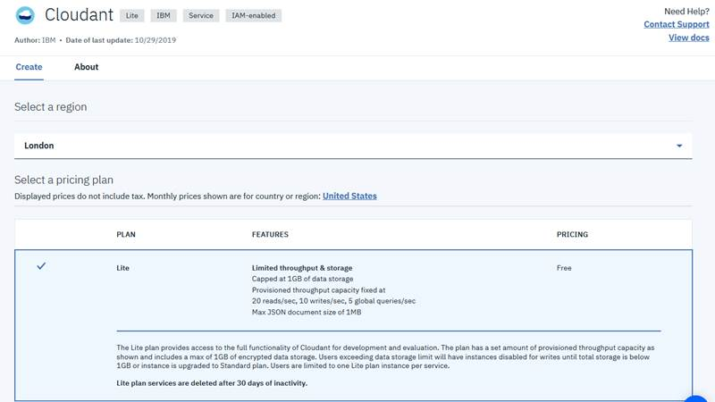

* [ ] Accept the default values for service name and resource group.
* [ ] In **Available authentication methods**, select **Use only IAM**, as shown in the following figure. 

 Update to Marcela's comment on line 76


✍ The Cloudant service has two authentication methods that are available: **Use both legacy credentials and IAM**, which means that both IAM and Legacy credentials can be used to access the account, and Use only IAM, which means that only IAM credentials are provided through service binding and credential generation.

* Legacy credentials enable login to Cloudant by using HTTP Basic authentication by providing a user name and password that is used for authentication. 
* Identity and Access Management \(IAM\) provides a unified approach to managing user identities, services, and access control. IAM authentication requires that an IAM API key is exchanged for a time-limited access token before you can make a request to Cloudant. When the access token expires, the client must obtain a new one from the IAM token service.

  In this exercise, you use the IAM method as the authentication method for the Cloudant service.

  Update to Don's comment


* [ ] Click **Create**, as shown in the following figure.


* [ ] After the service is created, you are redirected to the Resource list window, as shown in the following figure. Open the Cloudant service instance overview by clicking the newly created service in the Resource list window. Update to Don's comment line 88

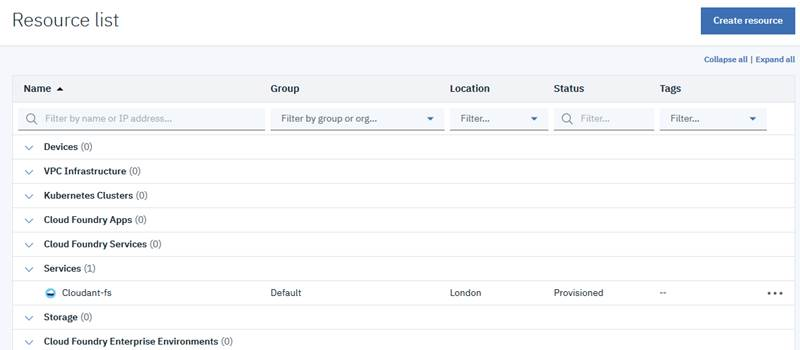


✍ After you create the service, it takes a few minutes to be provisioned, as shown in the following figure. The status is “Provision in progress” for a while. If it takes too long for the status to change to “Provisioned”, refresh the browser.

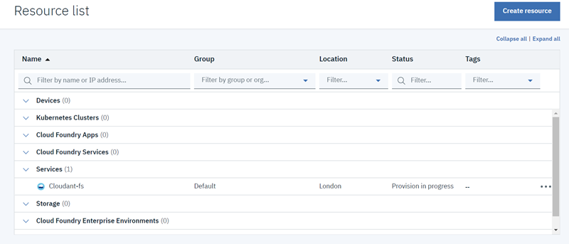


### Part 3. Exploring the Cloudant service on IBM Cloud

The Cloudant service instance has an overview page on IBM Cloud where you can perform the following actions:

* Access the Cloudant dashboard. 
* Create credentials to connect manually to an external consumer. 
* Connect automatically with an internal IBM Cloud application. 
* Upgrade the plan. 
* Manage a Cloudant instance and perform many other actions that are related to the Cloudant service on IBM Cloud. In this section, you discover these capabilities.

Complete the following tasks:

* [ ] In the **Resource list** under **Services**, click the newly created Cloudant service instance.


* [ ] After you open the Cloudant service instance, you are redirected to the overview page of the service. In the left pane are the Manage, Service credentials, Plan, and Connections menu options, as shown in the following figure.


The Manage section has four tabs: **Overview**, **Dashboard**, **Capacity**, and **Docs**, which are in the right pane. The Manage section also includes the **Launch Cloudant Dashboard** button, which opens the Cloudant dashboard.

* The _Overview_ tab \(shown in the following figure\) shows data about the current service, such as the deployment details, which include the location, endpoint, and authentication method that is used. It also shows capacity details, which include the current plan and the available storage. It also includes a section for important announcements that are related to Cloudant, such as showing new features and updates.


* The _Dashboard_ tab \(shown in the following figure\) includes quick access to specific sections in the Cloudant dashboard:
  * Databases, where you can create, update, and delete databases. 
  * Replication, where you can create or edit existing replication jobs.
  * Active tasks, where you can see indexing, replication, and compaction tasks that are actively running on your Cloudant instance.
  * Monitoring, where you can see the current consumption of provisioned throughput capacity and data storage that is being used by your applications


* The _Capacity_ tab shows the current capacity that is available for your application and the current plan that is used, as shown in the following figure.


* The _Docs_ tab includes a direct link for Cloudant documentation, some tutorials about Cloudant, and open source libraries for connecting with Cloudant for all major development languages, as shown in the following figure.


* [ ] In the Docs tab, select **Learning Center** or alternatively, from another browser tab, go to the following address: [https://developer.ibm.com/clouddataservices/docs/cloudant/](https://developer.ibm.com/clouddataservices/docs/cloudant/)
* [ ] In the IBM Cloudant Learning Center window, click **Load Data**, as shown in the following figure.


You can also get to this page by going to the following address: [https://developer.ibm.com/clouddataservices/docs/cloudant/load-data/](https://developer.ibm.com/clouddataservices/docs/cloudant/load-data/)

* [ ] Read the entire document, including the tutorials, and watch all the videos in this page. You do not need to do the tutorials. When you finish reading this document, close the browser tab for IBM Cloudant dashboard.
* [ ] In the left pane of the Cloudant service overview page in IBM Cloud, explore the other sections:
* **Service credentials**, where you can create a set of credentials so that an external consumer can use the Cloudant Rest APIs, as shown in the following figure.


* **Plan**, where you can upgrade your current plan, as shown in the following figure


* **Connections**, where you can connect the service with any existing Cloud Foundry applications on the same organization.


### Part 4. Creating credentials for a Cloudant service instance

To connect your Cloudant service with external consumers such as external applications or REST API clients, you must create credentials. In this section, you create a set of credentials for the Cloudant service that will be used in the next sections to submit HTTP API calls from an HTTP API client.

Complete the following tasks:

* [ ] From the Cloudant service Overview page, select **Service credentials** from the left pane, as shown in the following figure. Update for Don's comment line 88.


* [ ] In the Service credentials page, click **New credential+** as shown in the following figure.


* [ ] Keep the default values that are shown in the window and click **Add**, as shown in the following figure.

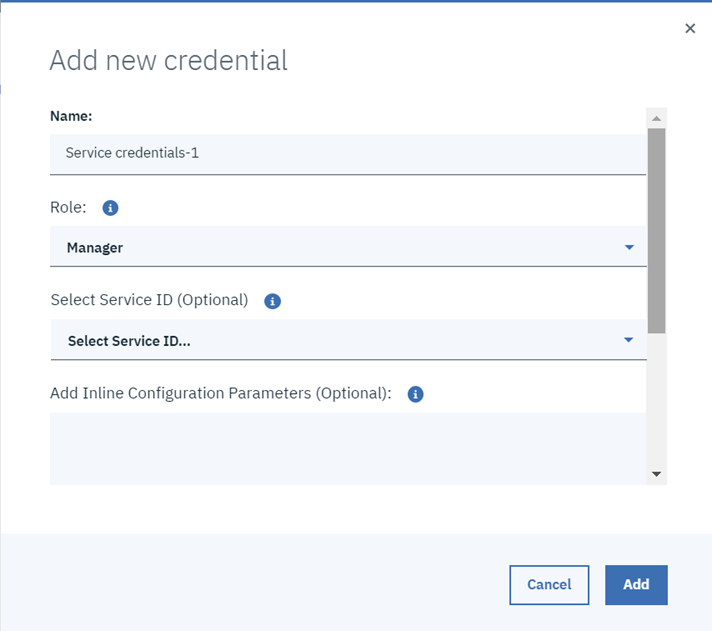


✍ The Add new credential window includes the following fields:

* _Role_ defines the actions that are permitted when the service is accessed. This field currently allows the Manager role only.
* _Service ID_ identifies a service or application similar to how a user ID identifies a user. There are two options for creating service ID: Auto generating one or by creating a customized one.
* _Add Inline Configuration Parameters \(Optional\)_ provides service-specific configuration parameters in a valid JSON object.


* [ ] After the set of credentials is created successfully, open the new service credentials by clicking **View credentials**, as shown in the following figure. 

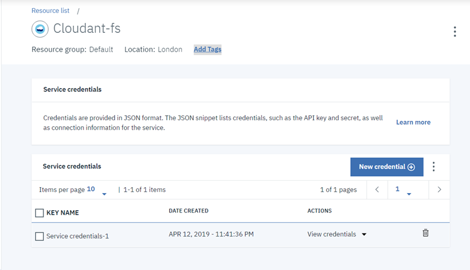

* [ ] Click the **Copy to clipboard** icon on the right to copy the credentials data that is kept in JSON format, as shown in the following figure. Then, create a file on your favorite text editor, paste the credentials into the newly created file, save it in your local workstation, and name it `cloudant_credentials.json`. 


### Part 5. Exploring the features of the Cloudant dashboard

The Cloudant dashboard has a simple structure that you can use to discover and use Cloudant features. These features include the following ones:

* Database management, including database creation and deletions.
* Documents management: create, read, update, and delete \(CRUD\) operations, indexes, and Cloudant queries.
* Monitoring, including the operations activity and storage.
* Replication of both remote and local databases.

In this section, you explore and apply some of these features. You create a database, and then you apply CRUD operations to Cloudant documents. You also use Cloudant query to view Cloudant documents based on some specified conditions.

Complete the following tasks:

* [ ] From the left pane of the Cloudant instance service, select **Manage**, as shown in the following figure.


* [ ] Click **Launch Cloudant Dashboard**, as shown in the following figure.


* [ ] The Cloudant dashboard opens in a new browser tab, as shown in the following figure.

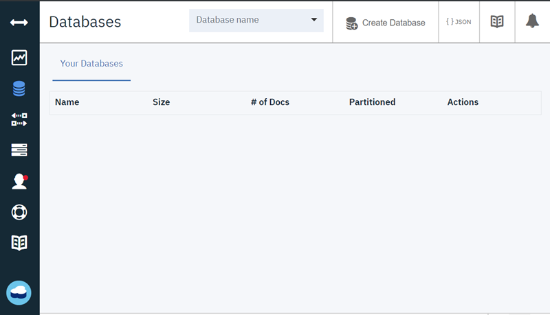

* [ ] Create a database and name it novels. Click **Create Database** on the top bar, as shown in the following figure.


* [ ] Name the database **novels**, select **Non-partitioned**, and then click **Create**, as shown in the following figure.



✍ While you are creating a database, there is the option to make the database partitioned. A partitioned database is a newer type of IBM Cloudant database. This option is an advanced feature, so it is out of the scope of this exercise. For more information about this topic, see the following link: [https://cloud.ibm.com/docs/services/Cloudant/guides?topic=cloudant-database-partitioning\#database-partitioning](https://cloud.ibm.com/docs/services/Cloudant/guides?topic=cloudant-database-partitioning#database-partitioning)


* \[ After you create the database, you are redirected to the new database overview, as shown in the following figure.


* \[ \]Create a document for the “Oliver Twist” novel.  Click **Create Document**, as shown in the following figure.


* [ ] You are redirected to the document editor page, which contains by default a JSON object with an auto-generated `_id`, as shown in the following figure.



✍ The `_id` field is automatically generated by Cloudant because it is considered the unique key identifier for the document. You can override this key by providing a \_id with a unique value across the other documents.


* [ ] Replace the JSON object in the document editor with the following JSON object:

```text
{
  "_id": "novel_001",
  "name": "Oliver Twist",
  "author": "Charles Dickens",
  "year": 1839
}
```


* [ ] Click **Create Document**.
* [ ] After you create the document, you are redirected back to the database overview page, which contains the newly created document, as shown in the following figure.


* [ ] To show the full data of the newly created document in JSON format, select **{ } JSON** from the top tabs, as shown in the following figure. 



✍ After you create the document, you find a field that is called \_rev that is automatically generated by Cloudant. The \_rev field is used internally by the Cloudant database as a revision number. A revision number is added to your documents by the server when you insert or modify documents. You must specify the latest \_rev when you update a document or your request fails and returns a 409 error. This field helps you avoid conflicting data states. The revision number is also used to confirm that a client is trying to modify the current version of a document.



✍ You can also create a document by clicking the three dots vertical menu icon and selecting **+ New Doc**, as shown in the following figure.


Another option to create a document is to click the **+** icon next to **All Documents** in the left pane then select **New Doc +** as shown in the following figure.

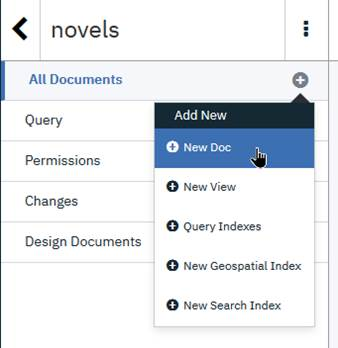


* [ ] Repeat the steps to create a new document three times by using the following JSON objects to add documents for “King Solomon's Mines”, “Treasure Island”, and “The Merry Adventures of Robin Hood” novels:

```text
{
  "_id": "novel_002",
  "name": "King Solomon's Mines",
  "author": "H. Rider Haggard",
  "year": 1885
}
{
  "_id": "novel_003",
  "name": "Treasure Island",
  "author": "Robert Louis Stevenson",
  "year": 1883
}
{
  "_id": "novel_004",
  "name": "The Merry Adventures of Robin Hood",
  "author": "Howard Pyle",
  "year": 1883
}
```

* [ ] Update the document of “Oliver Twist” novel. Return to the metadata view by selecting the **Metadata** tab from the top tabs, as shown in the following figure. 


* [ ] Select the document where `_id` corresponds to `novel_001` from the list of documents, as shown in the following figure. 


* [ ] The document editor opens. Change the name field to David Copperfield and the year to 1850, as shown in the following figure.

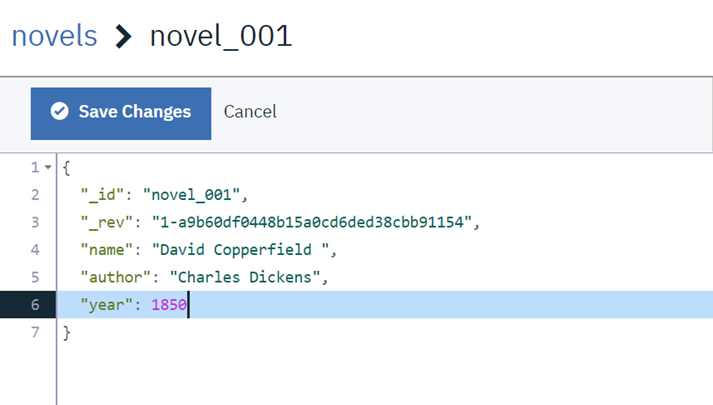

* [ ] Click **Save changes**.


**Important**‼ When you create a document, the \_rev field that is generated by Cloudant always starts with 1-, which indicates that this is the first version of this document. This number increments by 1 with each document update to highlight the document version number. The first digit in the revision number increments after the document update, as shown in the following figure.

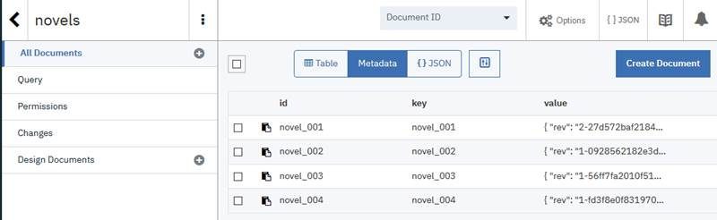


* [ ] Delete the document for the “The Merry Adventures of Robin Hood” novel. From the **novels** database overview page, select the document where `_id` corresponds to `novel_004` from the list of documents, as shown in the following figure. 


* [ ] Click **Delete** from the top bar, as shown in the following figure. 

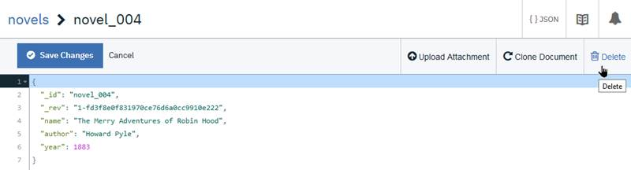

* \[ \]Click **Delete Document**, as shown in the following figure.


* [ ] Create a query to get the documents of the novels that are published after 1870. Select **Query** from left pane, as shown in the following figure.


* [ ] You are redirected to the query editor page, as shown in the following figure.


* [ ] Replace the JSON object in the editor with the following code.

```text
   "selector": {
      "year": {
         "$gt": 1870
      }
   },
   "fields": [
      "_id",
      "_rev",
      "name",
      "author",
      "year"
   ]
}
```

* [ ] Click **Run Query**, as shown in the following figure.


* [ ] The results are populated in the right pane, as shown in the following figure.


### Part 6. Using an HTTP API client to access Cloudant

Cloudant uses HTTP for all external communication to provide simple, web-based access to data in the Cloudant data store. The HTTP API is a programmatic way of accessing the data from any HTTP client consumer. It provides a set of HTTP access methods for create, read, update, and delete operations on Cloudant documents, and for using Cloudant query and many other features that are related to Cloudant.

In this part, you use an HTTP API client \(Postman\) to interact with Cloudant. You can use another HTTP API client, such as cURL or SOAP-UI, if you prefer.

Complete the following tasks:

* [ ] From the Start menu, find and open Postman. The window that is shown in the following figure opens.



✍ If a pop-up window opens when you open Postman, as shown in the following figure, close it and proceed with the steps normally.




* [ ] You use the Cloudant API key to get a time-limited access token that is used in all the upcoming requests to authenticate and authorize your access to Cloudant. After this token expires, you cannot use it anymore. To retrieve this access token, select the **`POST`** method from the **METHOD** menu, as shown in the following figure.


* [ ] Enter the following request URL into the POST field, as shown in the following figure: 

  [https://iam.cloud.ibm.com/identity/token](https://iam.cloud.ibm.com/identity/token)

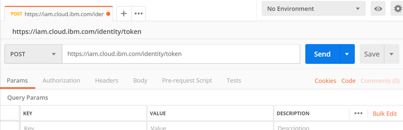

* [ ] Select the **Body** tab from the bar below the Post menu URL field, as shown in the following figure.


* [ ] Select x-www-form-urlencoded and then add the following keys and values, as shown in the following figure:
* Key: `grant_type` and value: `urn:ibm:params:oauth:grant-type:apikey`
* Key: `response_type` and value: `cloud_iam`
* Key: `apikey`, and the value for this field must include your Cloudant instance API key, which you can retrieve from the `cloudant_credentials.json` file. This file includes the Cloudant credentials, and you already saved it in your workstation in a previous step.


* [ ] Click **Send**, and you receive a JSON object response that includes the access token, which is valid for 60 minutes, as shown in the following figure.


* [ ] Copy the value of the access\_token because it is used in all the upcoming requests.


**Important** ‼ If the access\_token expires while you make any of the upcoming requests, repeat step 2 to retrieve a new access token and use it instead of the old one.



🤓 **Troubleshooting**: If you receive the error in the response that is shown in the following figure, verify that you provided the correct `apikey.`


\`\`


You can check the credentials of the service again from the service overview page on IBM Cloud, as shown in the following figure.



There is another way to retrieve an access token by using the IBM Cloud CLI as follows:

* Open the Command Prompt and log in to the IBM Cloud with the CLI where username is the IBM ID \(email\) that you use to log in to IBM Cloud\), password is your password and region is the region that corresponds to your location. 

```text
```ibmcloud login -u username -p password –r region```
```

* The following list shows the list of regions and locations:
  * Sydney: `au-syd`
  * Frankfurt: `eu-de`
  * London: `eu-gb`
  * Dallas: `us-south`
  * Washington DC: `us-east`
* To verify your Cloudant service region, you can check the location from the overview page on the IBM Cloud page, as shown in the following figure.


* Run the following command to get the access token that you can use in the Cloudant HTTP requests:

  `ibmcloud iam oauth-tokens`


* Copy the access token; you use it in the HTTP requests.


* [ ] To view all the documents in a database, issue a GET request to the following URL:

  `$URL/$DATABASE/_all_docs?include_docs=true`

To show all the documents in the novels database, complete the following tasks:

* [ ] Open a new tab in Postman by clicking _+_ in the top bar, as shown in the following figure. 

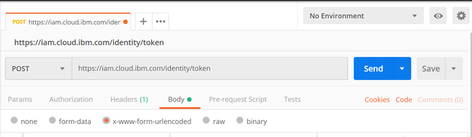

* [ ] Set the request method to the `GET` method.
* [ ] Set the request URL to `$URL/$DATABASE/_all_docs?include_docs=true`, as shown in the following figure:
  * Replace $URL with the value of the URL key in the `cloudant_credentials.json` file.
  * Replace `$DATABASE` with the database name **novels**.


* [ ] Select the **Headers** tab and add the following key and value, as  shown in the following figure:
  * Key: `Authorization`.
  * Value: `Bearer $ACCESS_TOKEN`. Replace `$ACCESS_TOKEN` with the access token that you obtained in the previously by running the command `ibmcloud iam oauth-tokens`. 


* [ ] Click **Send**. All three documents are displayed, as shown in the following figure.


To create a document, send a POST request to `$URL/$DATABASE` with the document's JSON content in the request body. To create a new document for “The Merry Adventures of Robin Hood” novel, complete the following steps, as shown in the following figure:

* [ ] Update the request URL to `$URL/$DATABASE`.
* [ ] Update the HTTP method to `POST`.


* [ ] To specify the content of the document that you want to create, click the **Body** tab from the tabs bar below the request URL, select the **raw** radio button, and then select the type as **JSON \(application/json\)**, as shown in the following figure.


* [ ] Enter the following code as the content of the document:

  ```text
  {
  "_id": "novel_004",
  "name": "The Merry Adventures of Robin Hood",
  "author": "Howard Pyle",
  "year": 1883
  }
  ```


✍ The `_id` should be a unique identifier for the document. If the `_id` is not provided, Cloudant generates an ID.


* [ ] Click **Send**.
* [ ] Check the response that shows the `_id` and `_rev` fields to verify the creation of the document, as shown in the following figure.


Create another document for the “Oliver Twist” novel by completing the following tasks:

* [ ] Update the content of the body as follows. 

```text
    {
  "_id": "novel_005",
  "name": "Oliver Twist",
  "author": "Charles Dickens",
  "year": 2005
}
```

```text
The results are shown in the following figure.
```


* [ ] Click **Send**.
* [ ] Check the response that shows the `_id` and `_rev` fields to verify the creation of the new document, as shown in the following figure.


Create another document for the “Ivanhoe” novel by completing the following tasks:

* [ ] Update the content of the body as follows. The results are shown in the following figure.

  ```text
  {
  "_id": "novel_006",
  "name": "Ivanhoe",
  "author": "Walter Scott",
  "year": 1820
  }
  ```


* [ ] Click **Send**.
* [ ] Check the response that shows the `_id` and `_rev` fields to verify the creation of the new document, as shown in the following figure.


To read the data of a specific document, send a `GET` request to `$URL/$DATABASE/$DOCUMENT_ID`. To get the data of the document of the “Oliver Twist” novel, complete the following tasks. The results are show in the following figure.

* [ ] Update the request URL to `$URL/$DATABASE/$DOCUMENT_ID`.
* [ ] Update `$DOCUMENT_ID` with the ID of the document of the “Oliver Twist” novel, which is `novel_005`.
* [ ] Update the HTTP method to `GET`.


* [ ] Click **Send**.
* [ ] Check the response that is shown in the following figure and copy the `_rev` value because it is required for updating the document in the next step.


* [ ] Copy the value of the **\_rev** field. 

To update a document, send a PUT request to `$URL/$DATABASE/$DOCUMENT_ID` with the updated document JSON content and the latest \_rev field. To update the year in the document of the “Oliver Twist” novel, complete the following steps, as shown in the following figure:

* [ ] Keep the request URL as `$URL/$DATABASE/novel_005`.
* [ ] Update the HTTP method to `PUT`.


* [ ] Update the request body with the following code, as shown in the following figure. Replace `$REV` with the `_rev` value that you copied in the previous step:

```text
{
"_rev": "$REV",
"name": "Oliver Twist",
"author": "Charles Dickens",
"year": 1839
}
 `
```


* [ ] Click **Send**. In the response, notice that the value of \_rev is updated \(Send response\), as shown in the following figure.

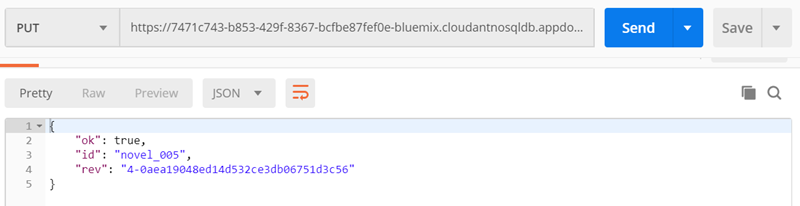

To read the data of a specific document, send a `GET` request to `$URL/$DATABASE/$DOCUMENT_ID`. So, to get the data of the document of the “Ivanhoe” novel, complete the following steps, as shown in the following figure:

* [ ] Keep the request URL as `$URL/$DATABASE/$DOCUMENT_ID`.
* [ ] Update `$DOCUMENT_ID` with the ID of the document of the “Ivanhoe” novel, which is `novel_006`.
* [ ] Update the HTTP method to `GET`.


* [ ] Click **Send**.
* [ ] Check the response as shown in the following figure and copy the `_rev` value because it is required for deleting the document in the next step.


To delete a document, issue a **`DELETE`** request for `$URL/$DATABASE/$DOCUMENT_ID?rev=$REV`. To delete the document of the “Ivanhoe” novel, complete the following steps, as shown in the following figure.

* [ ] Update the request URL to `$URL/$DATABASE/$DOCUMENT_ID?rev=$REV`.
* [ ] Update `$DOCUMENT_ID` with the ID of the document of the “Ivanhoe” novel, which is `novel_006`.
* [ ] Update `$REV` with the `_rev` value that you copied in the previous step.
* [ ] Update the `HTTP` method to **`DELETE`**.


* [ ] Click **Send**.
* [ ] Check the response that is shown in the following figure to verify the deletion of the document.



🤓 **Troubleshooting**: If you receive a conflict error in the response, as shown in the following figure, consider these reasons:

* Document creation: the error indicates that the \_id that is used to create this document is not unique and belongs to another document in the database.
* Document update or deletion: either the `_id` or the `_rev` that are used in the request are wrong.




* [ ] In the next steps, you query the documents of the novels that are published after the year 1880 and sort them by year in ascending order. To achieve this query, create an index for the year field that you apply to the query in the next step.
* [ ] To create an index, send a POST request to `$URL/$DATABASE/_index` with a body that includes the fields to be indexed. To create an index for the `year` field, complete the following steps, as shown in the following figure.
* [ ] Update the request URL to `$URL/$DATABASE/_index`.
* [ ] Update the HTTP method to **`POST`**.


* [ ] Update the request body with the following code, as shown in the following figure:

```text
{
   "index": {
      "fields": [
         "year"
      ]
   },
   "name": "year-json-index",
   "type": "json"
}
```


* [ ] Click **Send**.
* [ ] Check the response that is shown in the following figure and verify that the index is created successfully


* [ ] To query a document, issue a POST request to `$URL/$DATABASE/_find` with a selector in the body. A _selector_ is a JSON object that describes the criteria that is used to select documents. So, to query the documents of the novels that are published after the year 1880 and sort them by year in ascending order, complete the following steps:
* [ ] Update the Request URL to `$URL/$DATABASE/_find`.
* [ ] Keep the HTTP Method as **`POST`**.
* [ ] Update the Request body with the Cloudant Query content:
* “selector” specifies querying all documents with a `year` greater than `1880`.
* “fields” specifies that `_id`, `name`, `author`, and `year` should be returned in the query results.
* “sort” specifies to sort by year. To sort by any other field, an index should be created for the other field.

  ```text
    {
    "selector": {
        "year": {
            "$gt": 1880
        }
    },
    "fields": [
        "_id",
        "name",
        "author",
        "year"
    ],
    "sort": [
        {
            "year": "asc"
        }
    ]
    }
  ```

* [ ] Click **Send**.

The query results are returned in the response that is shown in the following figure. It is a good practice to create an index for each field that you are searching for in the selector to optimize query performance.



✍ By creating an index for the `year` field, you create and store a type of document that is called a _design document,_ which you store it in the Cloudant database. Design documents are special documents that serve specific functions other than storing the data. Design documents are used to build indexes, validate updates, and format query results.



🤓 **Troubleshooting**: If in the response to a Cloudant HTTP API request you receive the error HTTP status code 401 Unauthorized, as shown in the following figure, the access token is expired and you must create a new access token.




### Part 7. Deleting your Cloudant service instance

In this part, you delete your Cloudant service instance from your IBM Cloud account by completing the following tasks:

* [ ] Open the IBM Cloud dashboard. In the Resource summary pane, click **Services**, as shown in the following figure.


* [ ] You are redirected to the Resource list page. Under Services, you find your Cloudant service instance. Click the **More Actions** icon \(the three horizontal dots\), and then click **Delete**, as shown in the following figure.


* [ ] Confirm that you want to delete the service by clicking **Delete**, as shown in the following figure.


* [ ] Wait until the service is deleted.

## 🎓Exercise review and wrap-up

In this exercise, you created an instance of Cloudant on IBM Cloud. You created credentials for the service to make requests from an HTTP API client by using these credentials.

You explored the Cloudant dashboard and the features that are available in the Cloudant dashboard. You also created, read, updated, deleted, and queried Cloudant documents by using an HTTP API client. Update for MArcela's comment line 761. Final update.

## Testing additional formats with _VS code_

### Test code copy/paste

This is from GitBook

```text
ibmcloud plugin install kubernetes-service
```

Confirm that copy/paste works.

### Hints

* **Info**


:memo: This is a **note**. % endhint %}

:information\_source: This is **information**. % endhint %}

::hourglass\_flowing\_sand: This is **wait until...**. % endhint %}

* **Warning**

% hint style="warning" %} :warning: This is **warning**

% hint style="warning" %} ::eyes: This is **Important**

* **Danger**

% hint style="danger" %} :exclamation: This is **danger** or **caution**


### Tables

#### Simple table

| First Header | Second Header |
| :--- | :--- |
| Content from cell 1 | Content from cell 2 |
| Content in column 1 | Content in Column 2 |

#### More complex table

| Command | Description |
| :--- | :--- |
| git status | List all new or modified files |
| git diff | Show file differences that haven't been staged |

#### Formatting content within a table

| Command | Description |
| :--- | :--- |
| `git status` | List all _new or modified_ files |
| `git diff` | Show file differences that **haven't been** staged |

#### Aligning text in a table

| Left-aligned | Center-aligned | Right-aligned |
| :--- | :---: | ---: |
| git status | git status | git status |
| git diff | git diff | git diff |

#### Including a pipe as content in a table

| Name | Character |
| :--- | :--- |
| Backtick | \` |
| Pipe | \| |

